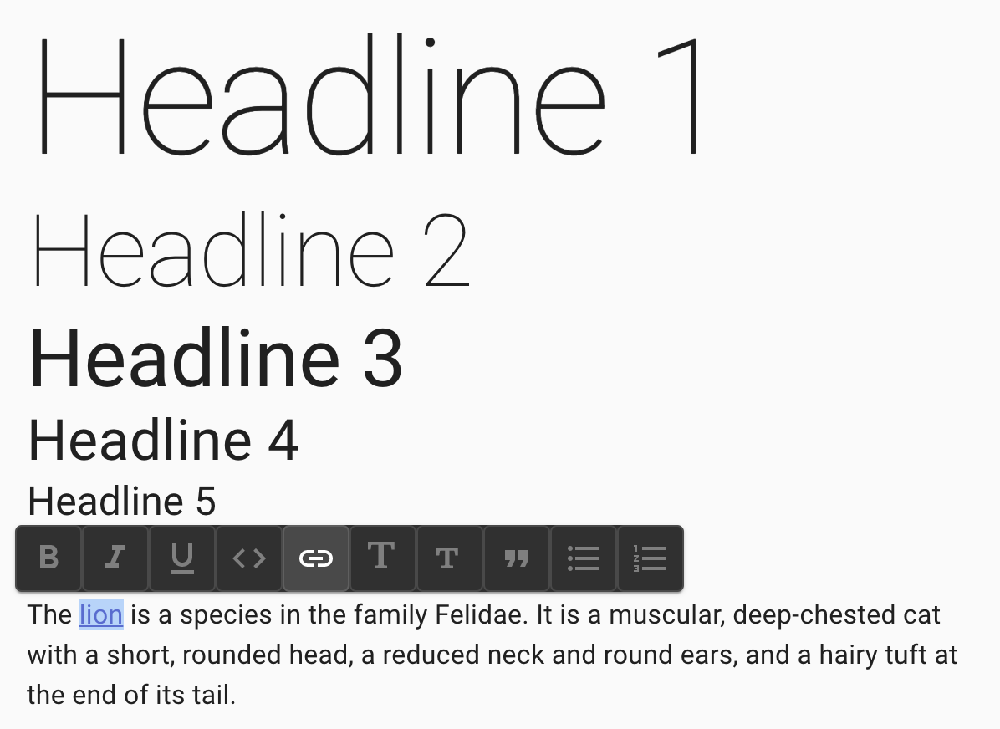

# React Force Slate Editor

This is a light-weight medium-style editor with no editor chrome - only a
floating toolbar to support basic editing functions. It is based on the
[Slate](https://docs.slatejs.org/) framework. You can try out a live demo
[here](https://nareshbhatia.github.io/react-force/?path=/story/slate-editor-slateeditor--slate-editor-story).



## Features

-   Import from JSON or HTML
-   Export as JSON or HTML
-   Floating toolbar pops up when text is selected
-   Supported elements: `h1`, `h2`, `h3`, `h4`, `h5`, `h6`, `p`, `blockquote`,
    `ul`, `ol`, `li`, `a`, `pre`, `img`
-   Supported marks: bold, italic, underline, strikethrough, code
-   Full undo/redo 
-   Paste HTML from clipboard
-   Paste links and images form clipboard

## Usage

### Minimal Example

This example uses a Slate document as its input and output.

```typescript jsx
import React, { useState } from 'react';
import { Node } from 'slate';
import { EmptyDocument, SlateEditor } from '@react-force/slate-editor';

export const Example = () => {
    const [value, setValue] = useState<Array<Node>>(EmptyDocument);

    return <SlateEditor value={value} onChange={setValue} />;
};
```

### HTML Example

This example uses an HTML document as its input and output.

```typescript jsx
import React, { Fragment, useState } from 'react';
import { Node } from 'slate';
import {
    deserializeFromHtml,
    serializeToHtml,
    SlateEditor,
} from '@react-force/slate-editor';

const initialValue = deserializeFromHtml('<p>Hello World!</p>');

export const Example = () => {
    const [value, setValue] = useState<Array<Node>>(initialValue);

    return (
        <Fragment>
            <SlateEditor value={value} onChange={setValue} />
            <div>{serializeToHtml(value)}</div>
        </Fragment>
    );
};
```

### Using in a form with Formik

To use the Slate Editor in a form, use the `RichTextField` component from
`@react-force/formik-mui`. See an example
[here](https://nareshbhatia.github.io/react-force/?path=/story/formik-richtextfield--rich-text-field-story).
